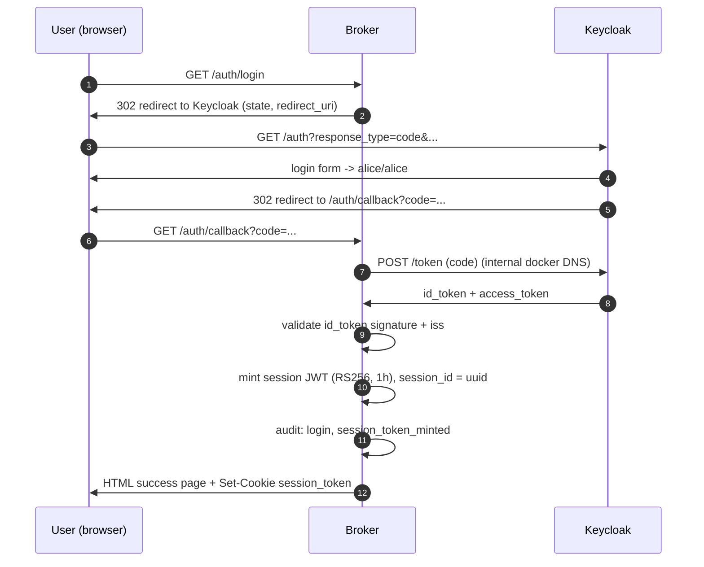
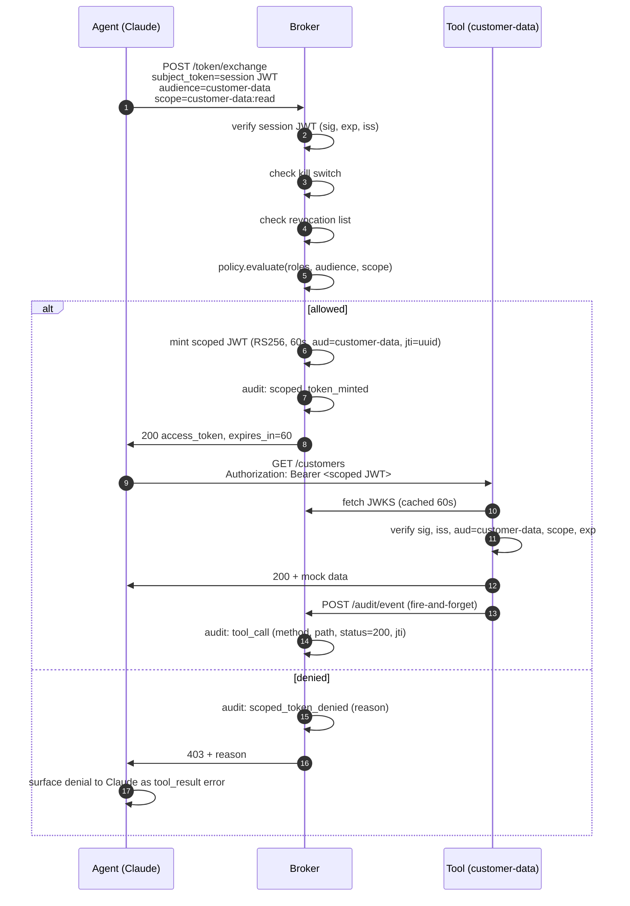
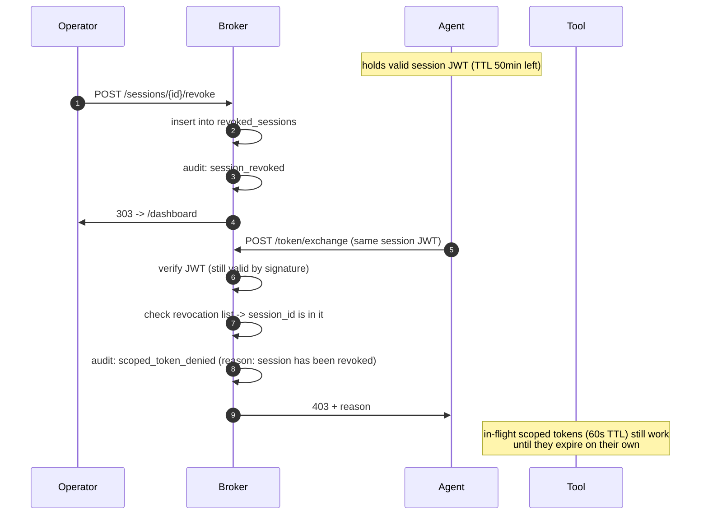

# Architecture

This doc explains what the broker does, why each component is shaped the way it is, what an attacker can and can't do against it, and what would have to change before running it in production.

## Why this exists

Most "AI agent" applications today ship in one of two shapes:

1. The agent runs with a single long-lived API key that has access to every tool the company exposes. Convenient. Catastrophic on first prompt injection.
2. Each tool requires the agent to authenticate as itself, and the agent acts as a single identity for every user it serves. Compliance teams cannot tell who actually caused which action.

Neither survives a SOC 2 or SOX audit. Neither gives a security team a meaningful kill switch.

The broker pattern in this repo addresses both: every tool call is bound to a specific human user, a specific session, a specific scope, and a specific 60-second token that the broker minted *after* checking policy.

## Actors

| Actor          | Role                                                                                  |
|----------------|---------------------------------------------------------------------------------------|
| **User**       | Human (`alice`). Authenticates once via the IdP.                                       |
| **IdP**        | Keycloak. Source of truth for user identity and realm roles.                          |
| **Broker**     | Issues session JWTs (1h) and scoped JWTs (60s). Owns the policy decision and audit.   |
| **Agent**      | Claude via the Anthropic SDK. Holds the session JWT and exchanges it per tool call.   |
| **Tool**       | Independent service (`customer-data`, `finance-data`, `email-send`). Validates JWTs against the broker's JWKS. |
| **Operator**   | Whoever is watching the dashboard. Can revoke a session or engage the kill switch.    |

## Component diagram

```
                       +----------------+
                       |   Keycloak     |
                       |   (IdP)        |
                       +--------+-------+
                                |
                                | OIDC code flow
                                |
+---------+           +---------v---------+         +-------------------+
|  User   +---------->+      Broker       +<------->+ SQLite (audit +   |
| (alice) |           |  /auth/*          |         |  revocation list) |
+----+----+           |  /token/exchange  |         +-------------------+
     |                |  /audit/*         |
     |                |  /dashboard       |
     | uses agent     |  /sessions/*      |
     v                |  /kill-switch     |
+----+----+           +---------+---------+
|  Agent  |                     |
| (Claude)+---------------------+
+----+----+         scoped JWT (60s)
     |
     | Authorization: Bearer <scoped JWT>
     v
+----+----+   +---------+   +-------------+
| customer|   | finance |   | email-send  |
|  -data  |   |  -data  |   |             |
+---------+   +---------+   +-------------+
   each validates the scoped JWT
   against /.well-known/jwks.json
```

## Token model

Two tokens. Both RS256, signed by the broker, validated against `/.well-known/jwks.json`.

### Session JWT
- TTL: 1 hour
- `aud`: `agent-broker:session` (only the broker accepts it)
- `sub`: Keycloak user ID
- `roles`: from Keycloak `realm_access.roles`
- `session_id`: UUID assigned by the broker on mint

### Scoped JWT
- TTL: 60 seconds
- `aud`: tool ID (e.g. `customer-data`). Only that tool accepts it.
- `scope`: e.g. `customer-data:read`
- `sub`, `session_id`: copied from the session JWT
- `jti`: unique per mint. Lets audit correlate broker mint with tool call.
- `act`: RFC 8693 actor claim noting "the agent acted on behalf of user X within session Y"

## Sequence: login



## Sequence: tool call



## Sequence: revocation mid-conversation



## Threat model

The broker is the trust boundary. Each line below is "what an attacker who has X can do to Y."

| Attacker capability                            | What they can do                                                                                              | What stops them                                                                                                  |
|------------------------------------------------|---------------------------------------------------------------------------------------------------------------|------------------------------------------------------------------------------------------------------------------|
| Stole a 60s scoped JWT                          | Call exactly one tool with exactly one scope for at most 60 seconds.                                          | TTL, `aud` binding to one tool, `scope` binding to one operation. Damage is bounded.                              |
| Stole a 1h session JWT                          | Exchange for further scoped tokens for whatever scopes the user's roles grant, for up to 1 hour.              | Operator can revoke the session. Kill switch denies all exchanges globally.                                       |
| Prompt-injected the agent                       | Make the agent attempt any tool call.                                                                          | Each call still goes through the broker; calls outside the user's role are denied. Agent has no out-of-band auth. |
| Compromised a tool service                      | Return false data to the agent.                                                                                | Tool cannot forge tokens for other tools (separate `aud`). Cannot grant itself new scopes.                        |
| Compromised the broker                          | Mint any token. Read any audit.                                                                                | **This is the actual prize.** Run the broker like a CA: hardened host, signed releases, separate secrets store.   |
| MITM between agent and broker                    | Replay tokens, steal credentials.                                                                              | Demo runs HTTP. Production must be mTLS or HTTPS + token binding.                                                 |
| Replay attack on the same scoped JWT             | Call the tool again within 60s.                                                                                | `jti` is unique; a real broker should also maintain a short-lived replay cache keyed by `jti`.                    |
| Lost user credentials                            | Log in as the user, mint any token.                                                                            | Outside the broker's scope. IdP MFA + conditional access policies.                                                |

## Design trade-offs and what's not here

This is a demo. Things that are deliberately simpler than they would be in production:

| Concern                | Demo                                                | Production                                                                              |
|------------------------|-----------------------------------------------------|-----------------------------------------------------------------------------------------|
| Policy storage         | Hardcoded `dict` in `policy.py`                     | OPA / Cedar / a real policy DB                                                          |
| Revocation list        | SQLite, single-row reads                            | Redis with TTL + bloom filter for hot paths                                             |
| Audit store            | SQLite file                                         | Append-only object store + queryable warehouse (e.g., S3 + Athena, or ClickHouse)        |
| Session token storage  | HttpOnly cookie + JSON page                         | Short-lived backend session + opaque token to the agent                                  |
| Token exchange         | RFC 8693-inspired but not fully compliant            | Use the actual `grant_type=urn:ietf:params:oauth:grant-type:token-exchange` semantics    |
| Tool-to-broker audit   | Open POST to `/audit/event`                          | mTLS between tool and broker, or signed batched audit logs                              |
| Replay protection      | Not implemented (60s TTL is the only defense)        | Short-lived `jti` replay cache, ideally on every tool                                    |
| Key management         | RSA file on a volume                                | Cloud KMS, HSM, key rotation                                                            |
| Hostname routing       | `host.docker.internal`-style local routing           | Real DNS, ingress, HTTPS                                                                |
| Dev-login endpoint     | Open password grant -> session JWT for the agent     | Real OIDC flow; agent gets tokens through a dedicated service-to-service trust path     |
| Tool sandboxing        | All tools share an image + python container          | Per-tool isolation, separate service accounts                                            |

## What "production-ready" would look like

The shortest path from this repo to a deployable broker:

1. Replace the policy `dict` with OPA. Keep the same `evaluate(roles, audience, scope)` interface.
2. Replace the SQLite revocation list with Redis (TTL = max session lifetime).
3. Add a `jti` replay cache on every tool, also in Redis. Reject any `jti` seen twice.
4. mTLS everywhere. The broker's CA signs both tool certs and tools' client certs to the broker's audit endpoint.
5. Move the RSA signing key to a cloud KMS. Rotate annually. The broker fetches a fresh key handle on boot; tools refresh JWKS once a minute.
6. Replace the dev-login endpoint with a real OIDC code flow for agents (or, in some shops, SPIFFE/SPIRE for service identity).
7. Wire `tool_call` audit to a real warehouse.
8. Lock the dashboard behind operator SSO.

Everything else in this repo, in particular the token format, the scope mint/verify flow, the audit correlation by `jti`, and the operator controls — survives.
